<div align="center">
  
    
  
  
  <br><br>
  
  <div align="center">
    <a href="https://github.com/saadkhalmadani">
      
    </a>
    <a href="https://github.com/saadkhalmadani?tab=followers">
      
    </a>
    <a href="https://www.linkedin.com/in/saad-khalmadani">
      
    </a>
  </div>
</div>

<br>

## 🚀 About Me

<table>
<tr>
<td width="50%">

**Hi! I'm Saad Khalmadani** 👋  
A passionate **DataOps Engineer** from Morocco 🇲🇦

I specialize in building **scalable, automated, and reliable data pipelines** that transform raw data into actionable insights through real-time analytics, automation, and visualization.

**What drives me:**
- 📊 **Data Engineering**: Streaming, pipelines, databases
- ⚙️ **DevOps Practices**: CI/CD, containerization, automation  
- ☁️ **Cloud & Big Data**: Kafka, Spark, Superset, Kylin
- ⚡ **Real-time Analytics**: IoT data processing & visualization

</td>
<td width="50%">

```yaml
current_focus:
  role: "DataOps Engineer"
  location: "Morocco 🇲🇦"
  experience: "Fresh Graduate"
  
specialties:
  - Real-time data streaming
  - Pipeline automation
  - Data visualization
  - Cloud infrastructure
  
currently_learning:
  - Kubernetes orchestration
  - Data mesh architecture
  - Terraform infrastructure
```

</td>
</tr>
</table>

---

## 🎯 Career Roadmap

```mermaid
graph LR
    A[🎓 Fresh Graduate] --> B[📈 6 Months<br/>Master DataOps &<br/>Cloud Infrastructure]
    B --> C[🚀 1-2 Years<br/>Lead Data Engineering<br/>& Architecture Projects]
    C --> D[🌟 Future<br/>Build Impactful<br/>Data-Driven Solutions]
    
    style A fill:#667eea,stroke:#333,stroke-width:2px,color:#fff
    style B fill:#764ba2,stroke:#333,stroke-width:2px,color:#fff
    style C fill:#f093fb,stroke:#333,stroke-width:2px,color:#fff
    style D fill:#ffeaa7,stroke:#333,stroke-width:2px,color:#000
```

<div align="center">



</div>

---

## 📊 Key Achievements

<div align="center">
<table>
<tr>
<td align="center" width="25%">
<br>
<strong>40% Faster</strong><br>
SQL & MongoDB queries
</td>
<td align="center" width="25%">
<br>
<strong>Real-time</strong><br>
Kafka pipelines for IoT
</td>
<td align="center" width="25%">
<br>
<strong>10+ hours/week</strong><br>
saved via Python automation
</td>
<td align="center" width="25%">
<br>
<strong>Interactive</strong><br>
dashboards with Superset
</td>
</tr>
</table>
</div>

---

## 🛠️ Tech Stack

<div align="center">

### Languages
<p>
  
</p>

### Databases & Storage  
<p>
  
  
  
  
</p>

### Big Data & Streaming
<p>
  
  
  
  
  
</p>

### DevOps & Tools
<p>
  
  
  
</p>

### Design & Visualization
<p>
  
  
  
</p>

</div>

---

## 🌟 Featured Projects

<div align="center">
<table>
<tr>
<td width="50%">

### 🎮 [DofusDataForge](https://github.com/saadkhalmadani/DofusDataForge-project)
**Data Scraping + Visualization Platform**

<a href="https://dofusdataforge-project.streamlit.app/">
  
</a>

**🔑 Login:** `bob` **🔒 Password:** `bobpass`

**Features:**
- 🔍 Extracts structured monster data from Dofus Touch
- 💾 PostgreSQL storage with multiple export formats
- 📊 Interactive Streamlit dashboard 
- 🔎 Advanced filtering and search capabilities

**Tech:** Python • Selenium • PostgreSQL • Streamlit

</td>
<td width="50%">

### ⚡ [Realtime CDC Streaming](https://github.com/saadkhalmadani/realtime-cdc-streaming-project)  
**IoT Data Streaming Pipeline**

**Architecture:**
- 📡 Real-time sensor data ingestion with Kafka
- ⚙️ Stream processing powered by Spark
- 📈 Interactive analytics in Superset
- 🔄 Change Data Capture with Debezium

**Tech:** Kafka • Debezium • Spark • Superset

</td>
</tr>
</table>
</div>

---

## 📈 GitHub Analytics

<div align="center">
<table>
<tr>
<td width="50%">

</td>
<td width="50%">

</td>
</tr>
<tr>
<td colspan="2" align="center">

</td>
</tr>
</table>
</div>

---

## 📊 Contribution Activity

<div align="center">
  
</div>

---

## 🏆 Top Repositories

<div align="center">
  
</div>

---

## 🌱 Currently Exploring

<div align="center">
<table>
<tr>
<td align="center" width="33%">
<br>
<strong>Cloud-Native</strong><br>
<code>Kubernetes • Terraform</code><br>
<small>Container orchestration</small>
</td>
<td align="center" width="33%">
<br>
<strong>Data Mesh</strong><br>
<code>Kafka • Event Streaming</code><br>
<small>Distributed data architecture</small>
</td>
<td align="center" width="33%">
<br>
<strong>MLOps</strong><br>
<code>Model Deployment</code><br>
<small>ML pipeline automation</small>
</td>
</tr>
</table>
</div>

---

## ☕ Fun Fact

<div align="center">
 
<em>By day I automate <strong>data pipelines</strong>, by night I perfect the art of <strong>Moroccan mint tea</strong> brewing</em>

</div>

---

<div align="center">
  
  ### 🤝 Let's Connect & Build Something Amazing!
  
  <a href="https://www.linkedin.com/in/saad-khalmadani">
    
  </a>
  <a href="https://github.com/saadkhalmadani">
    
  </a>
  <a href="mailto:your.email@example.com">
    
  </a>

  <br><br>
  
  
  
  <br>
  
  <em>🇲🇦 From Morocco with passion for data engineering • Always open to collaborate on innovative projects!</em>
  
</div>
